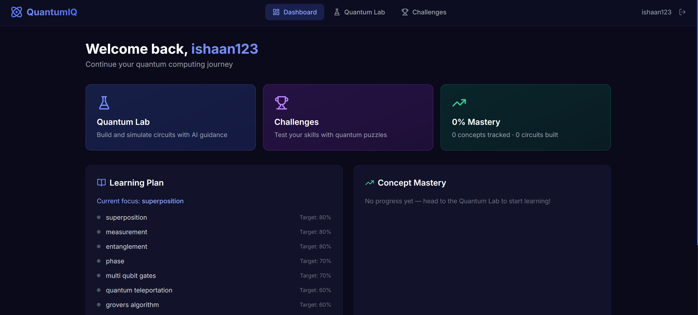
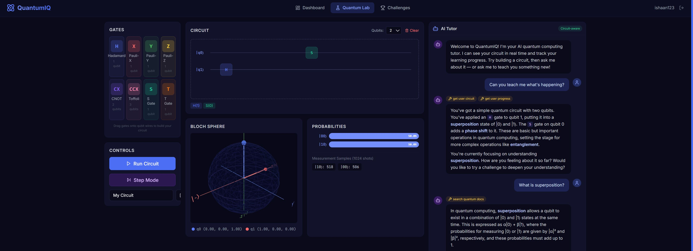
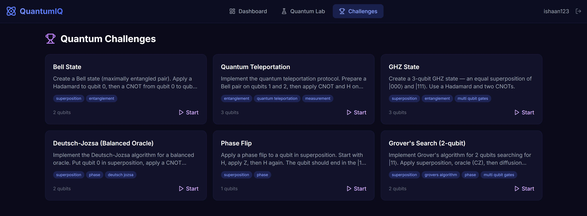

# QuantumIQ

**An agentic AI quantum computing learning platform.** The AI tutor autonomously reads your live circuit, tracks per-concept mastery in PostgreSQL, and rewrites your curriculum in real time — it's not a chatbot, it's an agent running an observe-decide-act loop on every message.

**Stack:** FastAPI · Qiskit · GPT-4o · PostgreSQL · React · TypeScript · Three.js · Docker

---

## Screenshots

### Dashboard — Personalized Learning Plan


### Quantum Lab — Circuit Builder + Live Bloch Sphere + AI Tutor

*The AI panel (right) shows tool calls in real time — `get user circuit`, `get user progress`, `search quantum docs` — before every response.*

### Challenges — 6 Preset Quantum Puzzles


---

## What Makes It Agentic

Most "AI-powered" apps are a chat box bolted onto an LLM. QuantumIQ's tutor runs a genuine **OODA loop** (Observe → Orient → Decide → Act) with OpenAI function calling before every response:

```
User sends message
       │
       ▼
┌─────────────────────────────────────────────┐
│              Agent Loop  (max 8 iter)        │
│                                              │
│  1. OBSERVE  ──► get_user_circuit()          │  reads live circuit from session
│                  get_user_progress()         │  reads mastery levels from PostgreSQL
│                                              │
│  2. ORIENT   ──► GPT-4o analyzes:            │  identifies weak areas, circuit
│                  • current topic             │  mistakes, progress gaps
│                  • mastery per concept       │
│                                              │
│  3. DECIDE   ──► GPT-4o picks an action:     │
│                  • teach a concept           │
│                  • generate_challenge()      │  targets weakest area
│                  • search_quantum_docs()     │  grounds answer in real content
│                  • update_learning_plan()    │  rewrites curriculum in DB
│                                              │
│  4. ACT      ──► writes back to PostgreSQL   │  persistent across sessions
│                                              │
│  ◄──────── loop until finish_reason = stop ──┤
└─────────────────────────────────────────────┘
       │
       ▼
   Final response (grounded in the user's actual circuit + history)
```

The key difference from prompt-stuffing: the agent **requests only what it needs** when it needs it, and **writes back** to the database. It remembers what it taught you last session because it persists to PostgreSQL — not just context.

---

## Quantum Simulation Pipeline

```
User drops gates onto circuit
          │
          ▼
  GateOperation[] ──► Qiskit QuantumCircuit
                            │
                    transpile + Aer StatevectorSimulator
                            │
              ┌─────────────┴──────────────┐
              │                            │
     partial_trace(ρ, qubit)         measurement sampling
              │                       (shots = 1024)
              │                            │
     Pauli decomposition            probability dict
     ⟨X⟩ = Tr(ρ·X)                  {'00': 0.5, '11': 0.5}
     ⟨Y⟩ = Tr(ρ·Y)                            │
     ⟨Z⟩ = Tr(ρ·Z)                   ProbabilityBars.tsx
              │
     BlochSphere.tsx
     (lerp-animated Three.js via useFrame)
```

Step-through mode re-runs this pipeline after each gate so you can watch the Bloch sphere rotate in real time as gates are applied.

---

## Tech Stack

| Layer | Tech | Why |
|-------|------|-----|
| Backend | FastAPI + Python | Async-native, Pydantic validation, auto Swagger at `/docs` |
| Quantum | Qiskit 2.x + Aer | Statevector simulation, density matrix, Bloch coordinates |
| AI Agent | GPT-4o + function calling | 6-tool OODA loop, conversation history, 8-iteration max |
| Database | PostgreSQL + asyncpg | JSONB circuits, relational mastery tracking |
| Auth | JWT + bcrypt | Stateless, `python-jose`, secure password hashing |
| Frontend | React 18 + TypeScript + Vite | react-dnd circuit builder, react-markdown chat |
| 3D Viz | Three.js + @react-three/fiber | Bloch sphere with `useFrame` lerp animation |
| Styling | Tailwind CSS | Dark quantum theme, custom color palette |
| Deployment | Docker Compose | One-command full-stack startup |

---

## Quick Start

**Prerequisites:** Docker Desktop · OpenAI API key

```bash
git clone https://github.com/ishaan2947/QuantumIQ.git
cd QuantumIQ

# Set your API key
cp backend/.env.example backend/.env
# Edit backend/.env and set: OPENAI_API_KEY=sk-...

# Launch everything
docker compose up --build
```

| Service | URL |
|---------|-----|
| App | http://localhost:5173 |
| API docs | http://localhost:8000/docs |

---

## Features

**Circuit Builder**
- Drag-and-drop gate palette: H, X, Y, Z, S, T, CNOT, Toffoli
- Multi-qubit wired diagram with labeled qubits
- Step-through animation — watch state evolve gate by gate
- Save and share circuits via UUID token links

**Quantum Visualization**
- Animated 3D Bloch sphere (Three.js) with lerp-smoothed transitions
- Live probability bar chart after each simulation
- Per-qubit Bloch coordinates displayed below the sphere

**Agentic AI Tutor**
- Circuit-aware: reads your gates before every response
- Persistent mastery: concept progress stored in PostgreSQL across sessions
- Generates personalized challenges targeting your weakest areas
- Rewrites your curriculum autonomously — no manual configuration
- Conversation history preserved across messages within a session
- Tool call transparency: the UI shows which tools the agent called and why

**Challenges**
- 6 preset circuits: Bell state, GHZ, Quantum Teleportation, Deutsch-Jozsa, Phase Flip, Grover's 2-qubit
- Agent-generated challenges tailored to individual weak areas
- Scoring via Bhattacharyya coefficient — compares output probability distributions
- Full attempt history tracked per user

---

## Project Structure

```
QuantumIQ/
├── backend/
│   ├── app/
│   │   ├── agent/
│   │   │   ├── agent.py          # OODA loop, GPT-4o orchestration
│   │   │   ├── executor.py       # Tool implementations (DB reads/writes)
│   │   │   └── tools.py          # OpenAI function calling schemas
│   │   ├── core/
│   │   │   ├── config.py         # Pydantic settings, env loading
│   │   │   ├── database.py       # Async SQLAlchemy engine + session
│   │   │   └── security.py       # JWT creation/validation, bcrypt hashing
│   │   ├── models/
│   │   │   ├── schemas.py        # Pydantic request/response models
│   │   │   └── *.py              # SQLAlchemy ORM models
│   │   ├── routes/               # FastAPI routers (auth, circuits, sim, chat...)
│   │   └── services/
│   │       └── quantum_simulator.py   # Qiskit integration
│   ├── .env.example
│   ├── Dockerfile
│   └── requirements.txt
├── frontend/
│   └── src/
│       ├── components/
│       │   ├── bloch/            # Three.js Bloch sphere
│       │   ├── circuit/          # Drag-and-drop builder, controls, charts
│       │   ├── chat/             # AI chat panel with markdown rendering
│       │   └── ui/               # Navbar
│       ├── hooks/                # useAuth, useCircuit (React context + state)
│       ├── pages/                # Dashboard, Lab, Challenges, Login, Register
│       ├── services/api.ts       # Axios client with JWT interceptor
│       └── types/index.ts        # Shared TypeScript types + gate catalog
├── docker-compose.yml
└── README.md
```

---

## API Reference

| Method | Endpoint | Description |
|--------|----------|-------------|
| `POST` | `/api/auth/register` | Create account, returns JWT |
| `POST` | `/api/auth/login` | Login, returns JWT |
| `POST` | `/api/simulate/` | Run circuit through Qiskit, return probs + Bloch coords |
| `POST` | `/api/simulate/step` | Step-through simulation (one state per gate) |
| `POST` | `/api/chat/` | Send message to agentic AI tutor |
| `GET`  | `/api/challenges/presets` | List preset challenges |
| `POST` | `/api/challenges/submit` | Submit attempt, get Bhattacharyya-scored result |
| `GET`  | `/api/progress/` | Per-concept mastery levels |
| `GET`  | `/api/progress/plan` | Current personalized learning plan |

Interactive docs auto-generated by FastAPI at `http://localhost:8000/docs`.

---

## License

MIT
